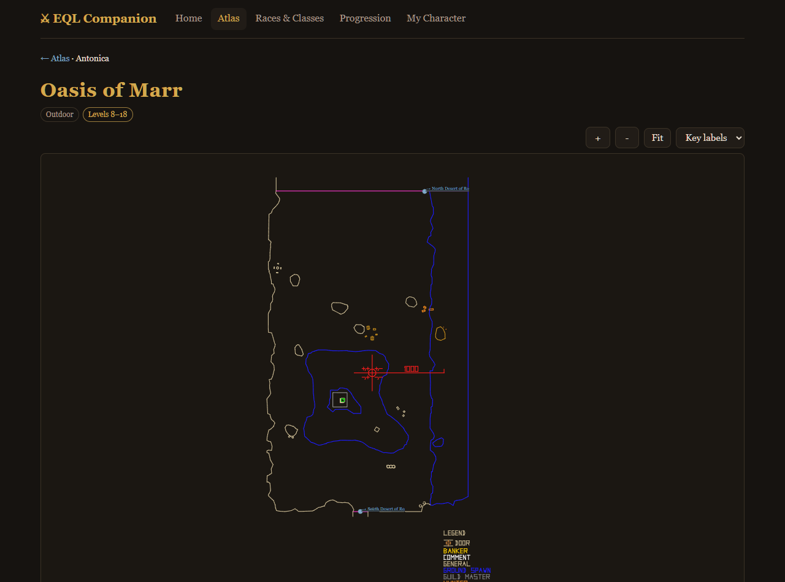
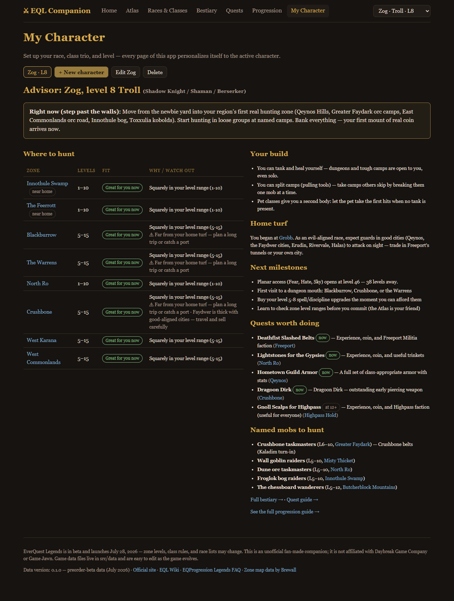

# EQL Companion

An unofficial fan-made companion app for **[EverQuest Legends](https://everquestlegends.com/)** — the reimagined classic Norrath from Daybreak and Game Jawn, launching July 28, 2026.

Set up your character (race, class trio, level) once, and every page personalizes itself: where to hunt, what to kill, which quests pay, and the exact hotbuttons to build before you pull.

**Live app:** https://eql.quest



## Features

- **🗺 Atlas** — all 67 launch zones across Antonica, Faydwer, Odus, and the Planes with level ranges, hunting camps, dangers, and connection graphs. Zone maps render real geometry from [Brewall's EverQuest maps](https://www.eqmaps.info/) as **aged parchment charts** — sepia ink, paper grain, compass rose, and title cartouche in the spirit of the classic [EQ Atlas](https://eqatlas.ca/atlas.html) — with pan/zoom, POI label filtering, multi-district city maps, and clickable zone-line exits.
- **⚔ Races & Classes** — 15 races, 16 classes, and a combo explorer that grades any trio of EQL's 3-class system for role coverage (tank / healer / CC / pull / pets). Every class links to a **detail page with its full spell/song list** (~1,500 spells harvested from the EQL Wiki — auto-granted vs. vendor vs. drop/quest sources), **skill tables** (trained vs. auto, caps through and past 50), and **complete AA tables** (class, archetype, general, and special).
- **🐉 Bestiary** — 106 curated named monsters, raid targets, and famous camps with levels, locations, and the loot that made them legends.
- **✉ Quest Guide** — repeatable XP turn-ins and iconic item quests, gated by level, race alignment (trolls need not apply to Qeynos), and class.
- **⌨ Macro Guide** — 41 classic social macros, including one-button cross-class rotations only possible with multiclassing (shaman slow → shadow knight lifetap, one hotkey).
- **🛡 Stances & Invocations** — all 9 melee stances and 9 magic invocations (EQL's replacement for disciplines), filtered to your trio with the multiclass scaling formulas computed for your combo.
- **🌀 Travel Guide** — the complete port network (druid rings/circles, wizard gates/portals, evacs, planar ports) plus the new Rituals system, color-coded by what your combo can cast at its current level.
- **📖 Systems Handbook** — AAs from level 1, Exaltation gear customization, tradeskill rules and formulas, instances & picks, deities, and loadout gear sets.
- **⚖ Faction Guide** — 19 significant classic-era factions with home zones, raise methods, rivalries, and banker gotchas, personalized to your race (home turf vs. KOS risk) — plus EQL's faction-achievement and race-unlock changes.
- **🕯 Lore & History** — the five ages of Norrath as a timeline, all 16 gods with domains and followers (linked to their visitable planes), 13 figures of note behind the zones, and a personalized "your place in the world" origin for your race.
- **📜 Progression Guide** — a band-by-band roadmap from the newbie yard to the planar endgame at 50.
- **🧭 Personal Advisor** — ranked hunting zones (level fit + walking distance from your home city + build durability + faction warnings), build analysis, quests worth doing now, named mobs in reach, and next milestones.
- **Installable PWA** — works offline, full map data included (~5.5 MB), multiple characters stored locally in your browser.



## Development

```bash
npm install
npm run dev        # dev server with hot reload
npm test           # vitest — data integrity + advisor logic (30 tests)
npm run build      # type-check + production build to dist/
npm run preview    # serve the production build
```

Built with Vite + React 18 + TypeScript (strict), `react-router-dom`, and `vite-plugin-pwa`. No backend — character profiles live in `localStorage`.

## Editing game data

The game is in beta and data will shift. Everything lives in typed, hand-editable files:

| File | Contents |
|---|---|
| `src/data/zones/*.ts` | zones: level ranges, connections, hotspots, dangers |
| `src/data/races.ts` / `classes.ts` | races, classes, legal primary classes, roles |
| `src/data/monsters.ts` / `quests.ts` | bestiary and quest guide |
| `src/data/macros.ts` | macro guide |
| `src/data/abilities.ts` | stances & invocations |
| `src/data/travel.ts` | port network & travel spells |
| `src/data/factions.ts` | faction guide |
| `src/data/lore.ts` | lore guide: eras, deities, figures, race origins |
| `src/data/classdata/*.json` | per-class spells, skills, AAs (generated — see below) |
| `src/data/progression.ts` | level-band leveling guide |

Run `npm test` after editing — integrity tests verify every cross-reference (zone connections, class ids, map coverage).

### Refreshing spells, skills & AAs

Per-class spell lists, skill caps, and AA tables are harvested from the [EQL Wiki](https://eqlwiki.com/) class pages and the Alternate Advancement page:

```bash
node scripts/import-classdata.mjs
```

This regenerates `src/data/classdata/*.json` (one lazy-loaded chunk per class plus `shared-aa.json`). Re-run it whenever the wiki gets a content pass — sparse classes (e.g. Ranger skills) fill in automatically as editors do.

### Refreshing map geometry

Zone maps are imported from Brewall's map pack:

```bash
# download + extract https://www.eqmaps.info/eq-map-files/ then:
node scripts/import-maps.mjs <path-to-extracted-brewall-folder>
```

This regenerates `src/data/maps/*.json` (one lazy-loaded chunk per zone).

## Verification scripts

`scripts/verify-app.mjs`, `verify-maps.mjs`, `verify-guides.mjs`, `verify-macros.mjs`, and `verify-systems.mjs` drive the built app in headless Chrome (via `puppeteer-core` and a local Chrome install) and assert end-to-end behavior — run any of them against `npm run preview`:

```bash
node scripts/verify-app.mjs http://localhost:4173 ./shots
```

## Credits & disclaimer

- Zone map data by **Brewall** — [eqmaps.info](https://www.eqmaps.info/)
- Game facts sourced from the [official site](https://everquestlegends.com/), [EQL Wiki](https://eqlwiki.com/), and [EQProgression](https://www.eqprogression.com/legends/faq/)
- This is an unofficial fan project, not affiliated with or endorsed by Daybreak Game Company or Game Jawn. EverQuest is a registered trademark of Daybreak Game Company LLC. Monster, quest, and zone details follow classic EverQuest (which EQL recreates) and may differ at launch.
